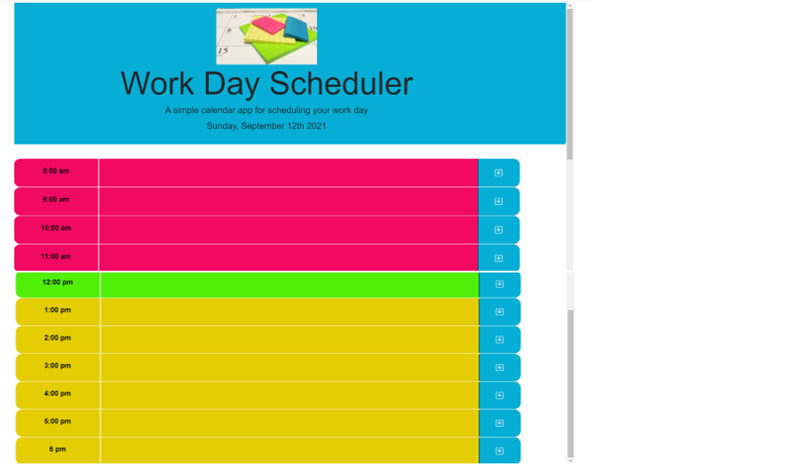

# Application Description
    This is calendar app for scheduling. That allows the user to save events for
    each hour of the day. Display the current date, and show time block is in the past,
    present or future by the color of the time block. The reset tasks button that clears 
    all saved tasks.

 # User Story
    AS AN employee with a busy schedule
    I WANT to add important events to a daily planner
    SO THAT I can manage my time effectively   

# Built With  
     •	HTML
     •	CSS
     •	Moment.js
     •	jQuery
     •	BootStrap
# Github:
   https://github.com/patelpr03/Work-Day-Scheduler

# Link to deployed application
    https://patelpr03.github.io/Work-Day-Scheduler/
# Screenshot : 

# Demo

